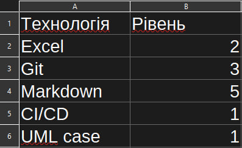

# Про мене

Я — студент/початківець у сфері інформаційних технологій, зацікавлений у
розробці програмного забезпечення, аналізі даних та створенні технічної
документації.

## Ключові компетенції
- Робота з Markdown та документацією
- Основи веб-розробки
- Робота з Git та GitHub
- Створення діаграм та схем
- Аналіз вимог та структуризація інформації

