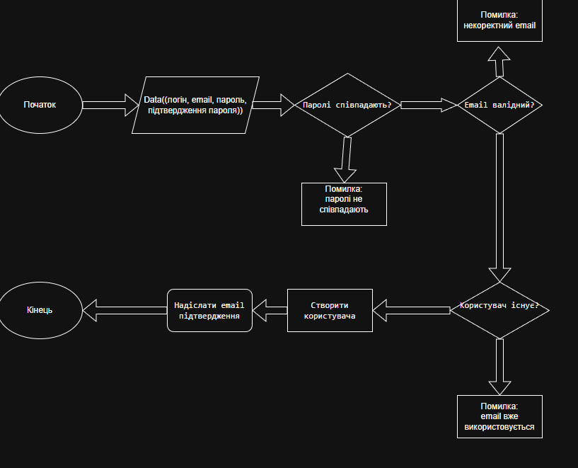

# Мої проєкти

## Навчальний проєкт 1: Персональний сайт
**Опис:**  
Створення статичного сайту-портфоліо з використанням MkDocs для
структурованого подання інформації.

**Технології:**  
MkDocs, Markdown, Git, GitHub

## Навчальний проєкт 2: Облік завдань
**Опис:**  
Навчальний проєкт для моделювання процесу роботи з завданнями:
від отримання до здачі на перевірку.

**Технології:**  
Markdown, diagrams.net, UML

## Блок-схема роботи проєкту

